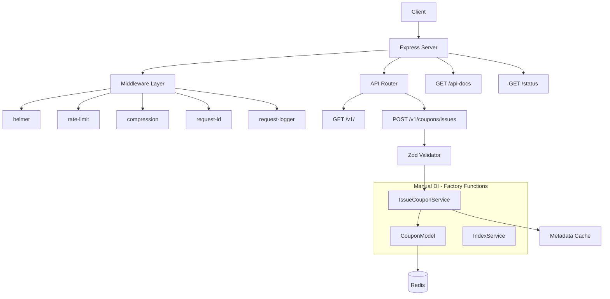

# Express Server Sample

프로덕션 수준의 패턴을 적용한 Express + TypeScript 예제 저장소.
선착순 쿠폰 발급 시스템을 통해 Redis 원자적 연산, 수동 DI, 보안 미들웨어, 테스트 전략 등을 시연합니다.

## 기술 스택

| 영역         | 기술                   |
| ------------ | ---------------------- |
| Runtime      | Node.js 22 LTS         |
| Framework    | Express 4              |
| Language     | TypeScript 5.8         |
| Database     | Redis (ioredis)        |
| Validation   | Zod                    |
| Logging      | Winston                |
| Testing      | Jest, Supertest        |
| Load Testing | k6                     |
| API Docs     | Swagger (OpenAPI 3.0)  |
| CI/CD        | GitHub Actions         |
| Container    | Docker, Docker Compose |

## 아키텍처



## 주요 기능

- **선착순 쿠폰 발급**: Redis `MULTI`/`SCARD`/`SADD` 원자적 연산으로 동시성 안전한 쿠폰 발급
- **중복 발급 방지**: Redis Set 기반 사용자별 1회 발급 보장
- **메타데이터 캐싱**: TTL 기반 인메모리 캐시로 Redis 조회 최소화
- **보안 미들웨어**: helmet, CORS, rate-limit, compression
- **요청 추적**: UUID 기반 Request ID + Winston 구조화 로깅
- **Graceful Shutdown**: SIGTERM 시 진행 중 요청 완료 후 Redis 연결 정리

## Quick Start

### 로컬 실행

```bash
# 의존성 설치
npm install

# .env 파일 생성
cp .env.sample .env

# Redis 실행 (로컬에 Redis가 필요합니다)
# brew services start redis  (macOS)

# 개발 서버 실행
npm run dev

# API 문서 확인
open http://localhost:3000/api-docs
```

### Docker 실행

```bash
# app + Redis 함께 실행
docker compose up

# 백그라운드 실행
docker compose up -d

# 종료
docker compose down
```

## 스크립트

| 명령어          | 설명                  |
| --------------- | --------------------- |
| `npm run dev`   | 개발 서버 (tsx watch) |
| `npm run build` | TypeScript 빌드       |
| `npm start`     | 프로덕션 서버         |
| `npm test`      | 테스트 실행           |
| `npm run lint`  | ESLint 검사           |

## 테스트

```bash
# 전체 테스트
npm test

# 커버리지 리포트
npx jest --coverage

# 특정 테스트만 실행
npx jest --testPathPattern=integration
```

### 테스트 구조

- `src/__tests__/unit/` - 단위 테스트 (서비스, 모델, 유틸리티)
- `src/__tests__/integration/` - API 통합 테스트 (supertest)
- `src/services/specs/` - 서비스 비즈니스 로직 테스트

## 부하 테스트 (k6)

```bash
# 기본 동작 확인
k6 run k6/smoke.js

# 부하 테스트 (ramp-up → sustained → ramp-down)
k6 run k6/load.js

# 스트레스 테스트 (spike, breaking point)
k6 run k6/stress.js
```

## API

| Method | Path                 | 설명        |
| ------ | -------------------- | ----------- |
| GET    | `/status`            | 헬스체크    |
| GET    | `/v1/`               | Hello World |
| POST   | `/v1/coupons/issues` | 쿠폰 발급   |
| GET    | `/api-docs`          | Swagger UI  |

## 프로젝트 구조

```
src/
├── __tests__/            # 테스트
│   ├── unit/             # 단위 테스트
│   └── integration/      # 통합 테스트
├── api/                  # 라우터 (v1)
├── config/               # 환경변수 (Zod 스키마)
├── loaders/              # Express, Redis, Swagger 초기화
├── messages/             # 에러/비즈니스 메시지
├── middlewares/           # 커스텀 미들웨어
├── models/               # 데이터 모델 (Redis)
├── services/             # 비즈니스 로직
├── types/                # TypeScript 타입 정의
├── utils/                # 에러 클래스, 응답 헬퍼
├── app.ts                # Express app 생성 (export)
└── server.ts             # 서버 시작 + graceful shutdown
```

## 설계 결정

- **수동 DI (Factory Functions)**: typedi 대신 명시적 의존성 주입. 서비스 2개 규모에서 DI 프레임워크는 과잉.
- **Zod 단일화**: 환경변수 검증과 request body 검증 모두 Zod로 통일.
- **ESLint 9 Flat Config**: 최신 ESLint 설정 형식 적용, `no-explicit-any: error`.
- **app/server 분리**: supertest에서 app 인스턴스 직접 import 가능, graceful shutdown을 위한 서버 인스턴스 관리.
- **메타데이터만 캐싱**: 쿠폰 발급 상태는 Redis 원자적 연산으로만 처리 (정합성 보장), 메타데이터만 인메모리 캐싱.
